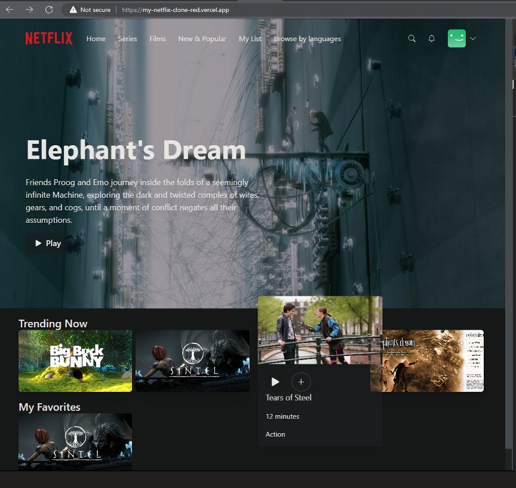
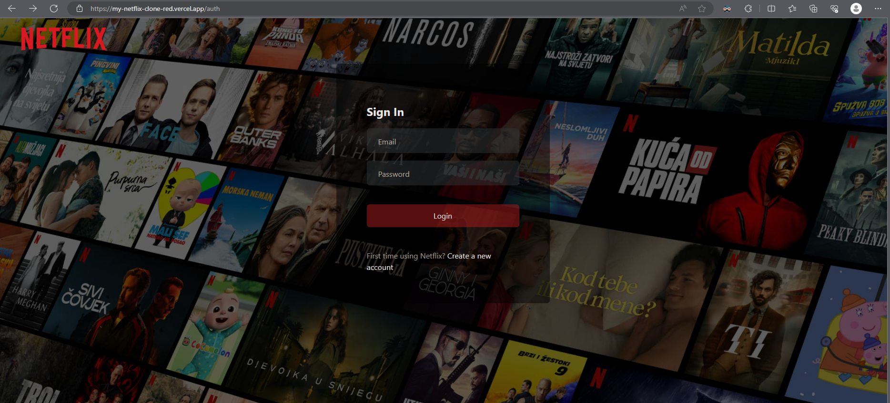
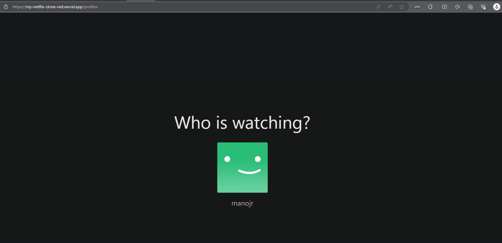
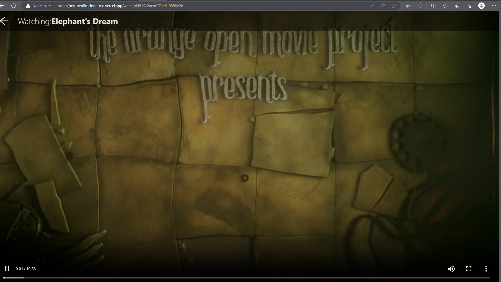

This is a Sample Fullstack Netflix Clone web application created using Next.js(Typescript).
Try this out at: https://my-netflix-clone-red.vercel.app/

## Technologies Used

1. Next.js (for client and server side)
2. Prisma (Database ORM)
3. MongoDB Atlas (Database)
4. Tailwind CSS (styling)

Credits to [Antonio](https://www.youtube.com/@codewithantonio) for the youtube tutorial.

This is a [Next.js](https://nextjs.org/) project bootstrapped with [`create-next-app`](https://github.com/vercel/next.js/tree/canary/packages/create-next-app).

## Getting Started

First, run the development server:

```bash
npm run dev
# or
yarn dev
# or
pnpm dev
```

## Sample Screenshots

### Dashboard page



### Auth page



### Profile Selection page



### Movie Player page


